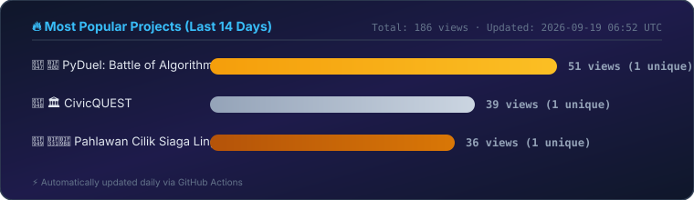

<h1 align="center">Hi, I'm Mario Fahmi Syahrial 👋</h1>
<h3 align="center">Lecturer · Researcher</h3>

  📍 Tuban, East Java &nbsp;•&nbsp;
  🎓 Universitas PGRI Ronggolawe (UNIROW) Tuban &nbsp;•&nbsp;
  ✉️ mariofahmiunirow@gmail.com

  
  

  
  
  

---

### 👋 About Me

> "Make reading a habit..."

Mario Fahmi Syahrial, S.Pd., M.Pd. is a lecturer in Pancasila and Civic Education (PPKn) at Universitas PGRI Ronggolawe (UNIROW) Tuban since 2015. He completed his Bachelor's degree in Sociology and Anthropology Education (2010) and his Master's degree in Social Studies Education (2015) from Universitas Negeri Semarang (UNNES). He has published dozens of scientific works, including Sinta-indexed and Scopus-indexed publications, as well as several monograph and reference books.

---

### 🎮 Game Projects

<table>
  <thead>
    <tr>
      <th width="28%" align="left">Project</th>
      <th width="58%" align="left">Description</th>
      <th width="14%" align="center">Release</th>
    </tr>
  </thead>
  <tbody>
    <tr>
      <td>🎲 <a href="https://mariofahmi.github.io/bogaseri/"><b>BOGA SERI</b></a></td>
      <td>An interactive web-based board game teaching Indonesian traffic safety, based on Law No. 22/2009 on Traffic and Road Transportation.</td>
      <td align="center"><nobr>2026-08-12</nobr></td>
    </tr>
    <tr>
      <td>🐍🪜 <a href="https://mariofahmi.github.io/Ular-Tangga-PIS/"><b>Ular Tangga PIS (Snakes &amp; Ladders)</b></a></td>
      <td>An educational Snakes &amp; Ladders game for Introduction to Social Sciences, with a 100-square board and interactive quiz ladders.</td>
      <td align="center"><nobr>2026-08-23</nobr></td>
    </tr>
    <tr>
      <td>👑 <a href="https://mariofahmi.github.io/SIAPA-INGIN-MENJADI-KAISAR-IPS/"><b>Siapa Ingin Menjadi Kaisar IPS</b></a></td>
      <td>A "Who Wants to Be a Millionaire"-style quiz game on Social Studies (IPS): climb 15 levels from Commoner to Emperor across 120 random questions, with 3 lifelines.</td>
      <td align="center"><nobr>2026-08-28</nobr></td>
    </tr>
    <tr>
      <td>⚖️ <a href="https://mariofahmi.github.io/Simulasi-Peradilan-Semu-PPKn-/"><b>Peradilan Semu (Moot Court Simulation)</b></a></td>
      <td>An interactive moot court simulation for PPKn UNIROW Tuban students, featuring 4 real trial cases (corruption, domestic violence, ITE Law, land disputes) and a 50-question exam bank.</td>
      <td align="center"><nobr>2026-08-29</nobr></td>
    </tr>
    <tr>
      <td>🎓 <a href="https://mariofahmi.github.io/Siapa-yang-Ingin-Menjadi-Mahaguru/"><b>Siapa yang Ingin Menjadi Mahaguru</b></a></td>
      <td>An educational quiz game with 15 academic-tier levels exploring the history of teachers, PGRI's transformation, and the AI revolution.</td>
      <td align="center"><nobr>2026-08-30</nobr></td>
    </tr>
    <tr>
      <td>🐍 <a href="https://mariofahmi.github.io/PyDuel-Battle-of-Algorithms/"><b>PyDuel: Battle of Algorithms</b></a></td>
      <td>An educational Python and algorithms game for university students — speed-duel against PyBot AI or try the 3-life Survival Run mode.</td>
      <td align="center"><nobr>2026-09-05</nobr></td>
    </tr>
    <tr>
      <td>🏛️ <a href="https://mariofahmi.github.io/CivicQUEST/"><b>CivicQUEST</b></a></td>
      <td>A PPKn education game featuring a Survival Quiz, an RPG-style Ethics Dilemma mode, a 7-zone Boss Battle, and a Pancasila Village Simulation.</td>
      <td align="center"><nobr>2026-09-06</nobr></td>
    </tr>
  </tbody>
</table>

---

### 📚 Education Projects

<table>
  <thead>
    <tr>
      <th width="28%" align="left">Project</th>
      <th width="58%" align="left">Description</th>
      <th width="14%" align="center">Release</th>
    </tr>
  </thead>
  <tbody>
    <tr>
      <td>🛰️ <a href="https://mariofahmi.github.io/webgis-pesisir-tuban/"><b>WebGIS Pesisir Tuban</b></a></td>
      <td>An interactive coastal mapping portal built with Leaflet &amp; Google Gemini AI Assistant, featuring 77 GPS points and 212 photos across 5 coastal districts of Tuban.</td>
      <td align="center"><nobr>2026-08-10</nobr></td>
    </tr>
    <tr>
      <td>🗓️ <a href="https://mariofahmi.github.io/Titen-Laku-Jawa/"><b>Titen Laku Jawa</b></a></td>
      <td>A modern, precise, and comprehensive application for calculating traditional Javanese time cycles, grounded in the ancient science of Javanese Titen Laku. Designed by Mario Fahmi Syahrial</td>
      <td align="center"><nobr>2026-09-11</nobr></td>
    </tr>
  </tbody>
</table>

---

### 📊 Contribution Activity

  
  &nbsp;
  

  

  

  

  

📈 Stats diperbarui otomatis setiap hari.

---

### 🛠️ Tech Stack

---

<i>⭐ Thanks for visiting my profile!</i>

